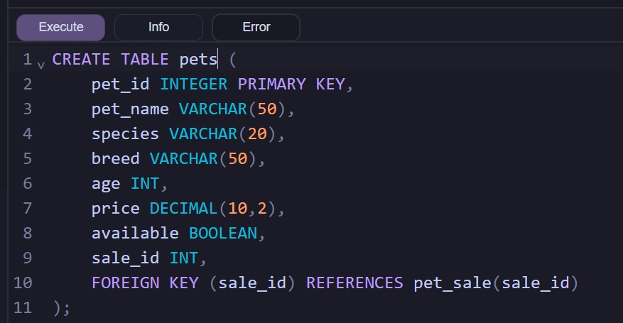
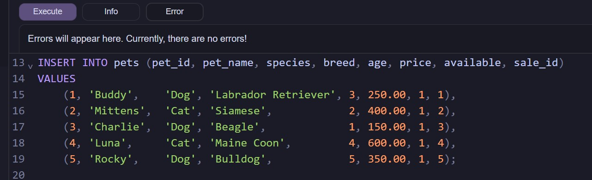
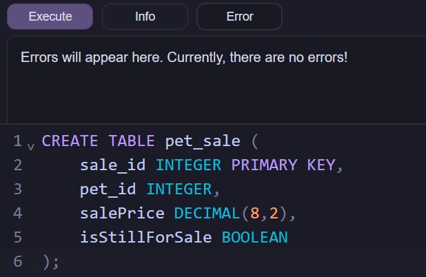
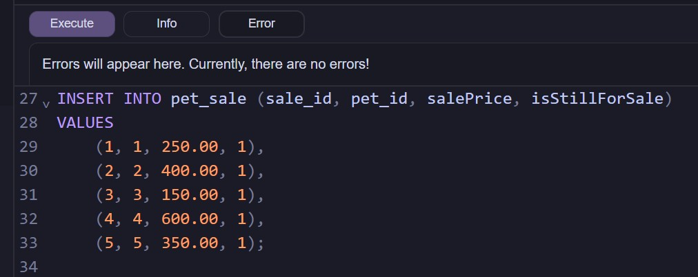
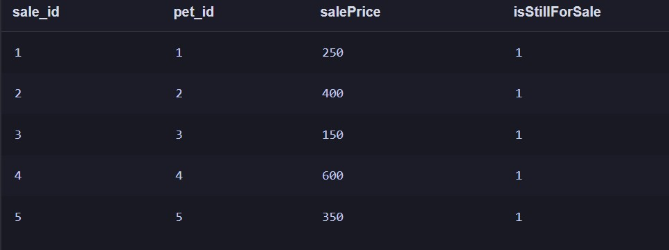
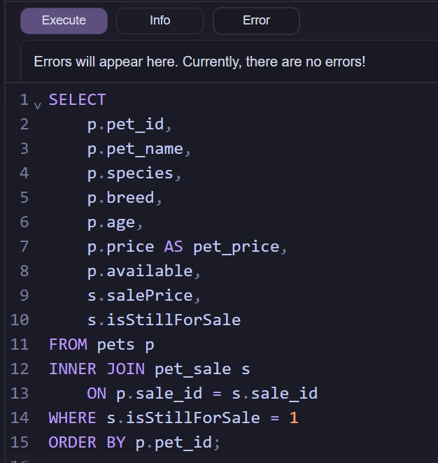
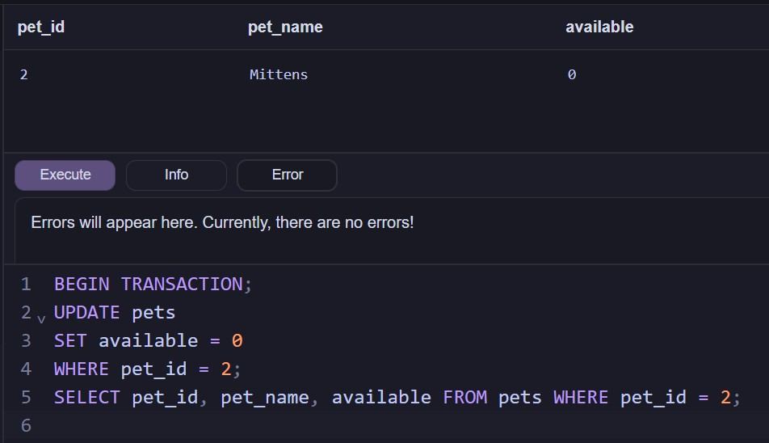
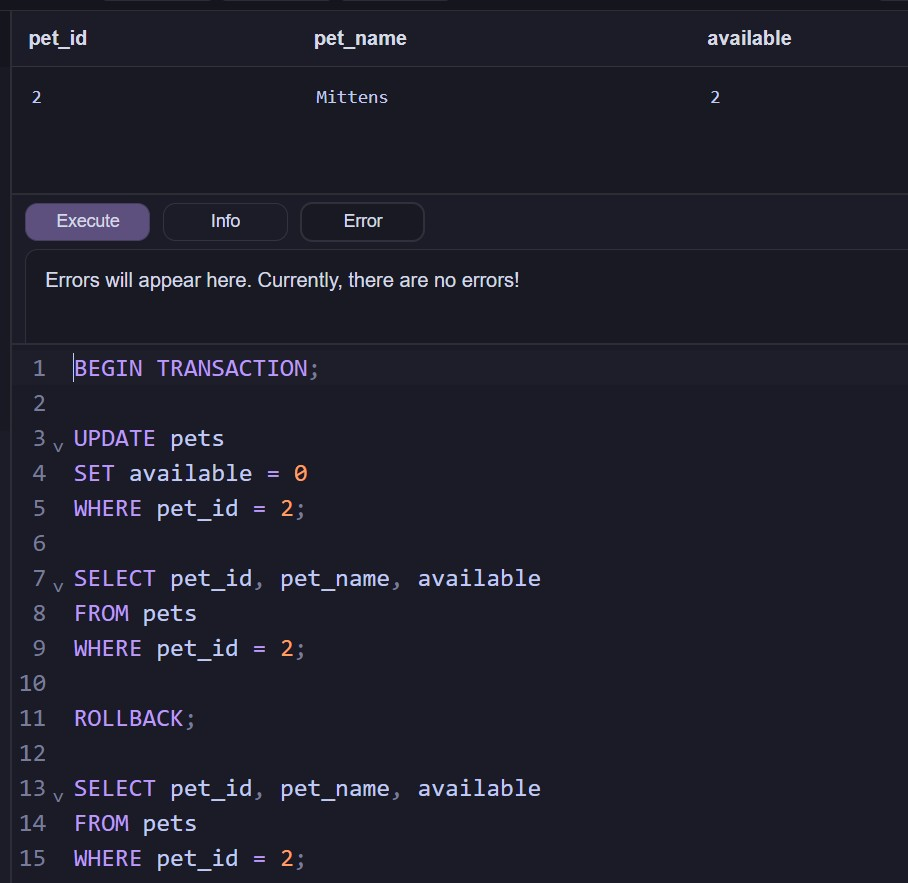
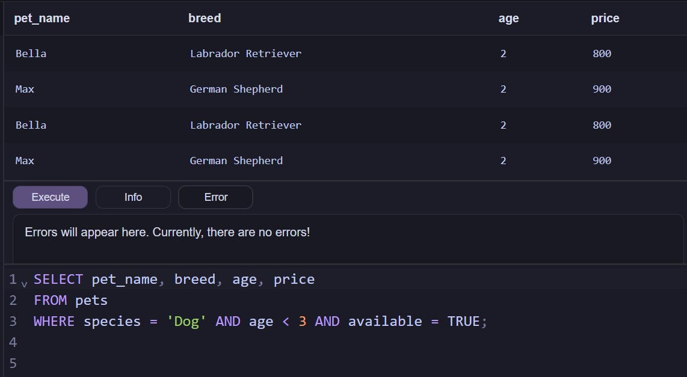
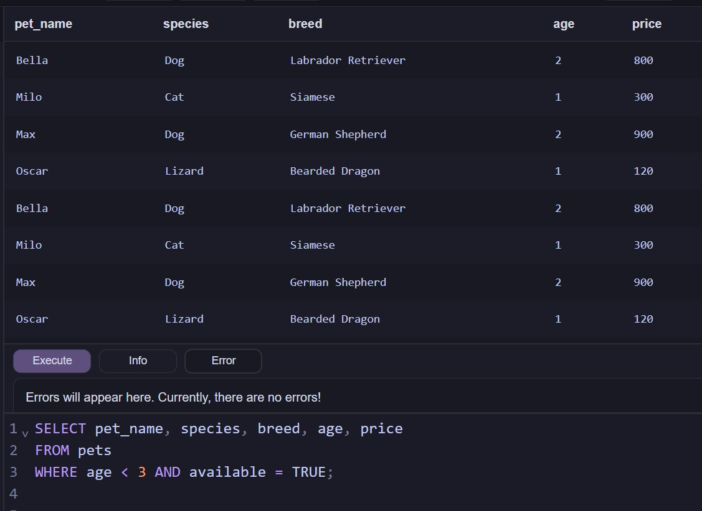

## Project Overview:

This project is a data analysis exercise built around a re-world use case where I own a pet store and sell dogs, cats, small rodents, and lizards.
I created a database table that was used to track pets that are owned by my pet store, then I insert mock data into the database table.

**Business Questions**

1. What are all pets that are currently available, and what are their current prices?

2. What if a pet is accidentally mark sold?

3. What dogs does the pet store have that are younger that 3 years old?
 
**What I learned:**
I gained experience relational databases from stratch that model rea-world business scenarios. I designed tables, define primary and foreign keys, used joins and performed a 'rollback' transaction. Overall I strengthened my knowledge of database design and query writing. I learned how to answer practical business questions through structured data.

## Skills and Program Used in This Project:
**Sandbox SQL**

- Unique identifiers

- Foreign and Primary Keys

- Joins

- Rollback

---

## 1. What are all pets that are currently available, and what are their current prices?

**Create two tables and insert data:** I wrote code in order to create a table and inserted mock data.

 

**Create new table to indicate cost for each pet.** I created a second table to track mock pricing and sales data for each pet.

 
 

**Combine the two tables to find data more efficiently**
I used an 'INNER JOIN' to connect the two tables using a foreign key in 'pets' and a primary key in 'pet_sale'. This acts as a filter for only those pets that are still for sale, then sorts them by pet ID.

**Results I expected:** The return of pet information (name, species, breed, age, price, availability) as well as the sales price. This kind of query allows the store associates to see all pets with their pricing in one view.

---

## 2. What if a pet is accidentally mark 'sold'?

**Begin a transaction** This allows me to make changes that don't save until I say 'commit'. I then performed the accidental availabiliy change.

    
**Rollback the error** I used the 'Rollback' command, and checked the results before selecting 'commit'.

 

**Results I expected:** Pet with `pet_id = 2` will be updated to available, or `'2'`. Since I started a transaction if any error occured, no changes are saved.

## 3. What dogs does the pet store have that are younger that 3 years old?

I used the logical operators 'AND' and 'WHERE' combine three conditions so that only rows that meet all of them are returned.

*I also performed a query for all pets with those perameters*

**Results I expected:** All available dogs under 3 years old, along with their name, breed, age, and price to return for finding young dogs that can be sold immediately.

---

## Key Insights:
A. Data modeling  
B. Real business logic  
C. Rollback transactions  
D. Query optimization using joins and views
